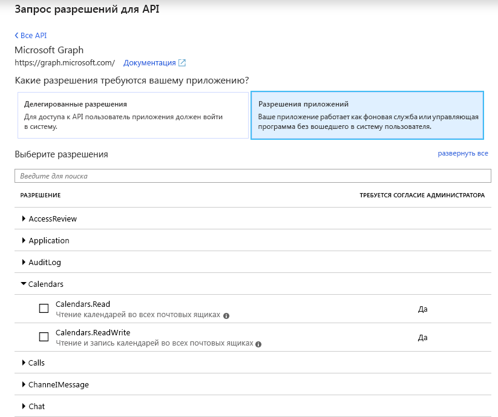
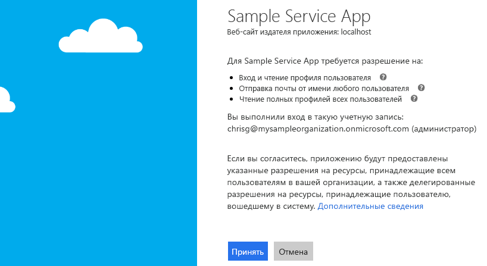

# <a name="get-access-without-a-user"></a>Получение доступа без пользователя

Некоторые приложения вызывают Microsoft Graph от своего имени, а не от имени пользователя. Зачастую это фоновые службы и управляющие программы, которые работают на сервере без выполнившего вход пользователя. Примером таких приложений можно назвать службу архивации электронной почты, которая выходит из спящего режима и работает в течение ночи. В некоторых случаях приложения также могут вызывать Microsoft Graph от своего имени, когда пользователь выполнил вход. Например, приложению может потребоваться возможность, для использования которой нужны более высокие привилегии, чем те, которыми обладает пользователь.  

Приложения, которые вызывают Microsoft Graph от своего имени, используют [поток предоставления учетных данных клиента](/azure/active-directory/develop/v2-oauth2-client-creds-grant-flow) OAuth 2.0 для получения маркеров доступа из Azure AD. В этой статье описываются основные действия по настройке службы и использованию потока предоставления учетных данных клиента OAuth, чтобы получить маркер доступа.

## <a name="authentication-and-authorization-steps"></a>Этапы аутентификации и авторизации

Чтобы настроить службу и получить маркер из конечной точки платформы удостоверений Майкрософт, необходимый службе для вызова Microsoft Graph от своего имени, нужно выполнить следующие действия:

1. Регистрация приложения.
2. Настройка разрешений для Microsoft Graph в приложении.
3. Получение согласия администратора.
4. Получение маркера доступа.
5. Вызов Microsoft Graph с помощью маркера доступа.

## <a name="1-register-your-app"></a>1. Регистрация приложения

Чтобы обеспечить прохождение проверки подлинности в конечной точке платформы удостоверений Майкрософт, необходимо сначала зарегистрировать приложение на [портале Azure для регистрации приложений](https://go.microsoft.com/fwlink/?linkid=2083908). Для регистрации приложения можно использовать либо учетную запись Майкрософт, либо рабочую или учебную учетную запись.

Чтобы служба могла вызывать Microsoft Graph от своего имени, вам нужно зарегистрировать приложение для веб-платформы и скопировать следующие значения:

- идентификатор приложения, назначенный порталом регистрации Azure;
- секрет клиента (приложения) — пароль либо открытый и закрытый ключ (сертификат);
- URL-адрес перенаправления, с помощью которого служба будет получать ответы с маркерами;
- URL-адрес перенаправления, с помощью которого служба будет получать ответы с согласием администратора, если в приложении реализованы функции для запроса согласия администратора.  

Инструкции по настройке приложения на портале Azure см. в статье [Регистрация приложения](./auth-register-app-v2.md).

Когда используется поток предоставления учетных данных клиента OAuth 2.0, приложение проходит аутентификацию непосредственно в конечной точке `/token` платформы удостоверений Майкрософт, используя идентификатор приложения, назначенный службой Azure AD, и секрет приложения, созданный вами на портале.

## <a name="2-configure-permissions-for-microsoft-graph"></a>2. Настройка разрешений для Microsoft Graph

Для приложений, вызывающих Microsoft Graph от своего имени, Microsoft Graph предоставляет специальные разрешения. (Microsoft Graph также может предоставлять делегированные разрешения для приложений, вызывающих Microsoft Graph от имени пользователя.) Предварительная настройка разрешений приложения, необходимых вашему приложению, выполняется при его регистрации. Разрешения приложения всегда требуют согласия администратора. Администратор может согласиться предоставить эти разрешения на [портале Azure](https://portal.azure.com) во время установки приложения в организации. Вы также можете создать в приложении интерфейс регистрации, где администраторы могут соглашаться на предоставление заданных вами разрешений. Когда согласие администратора фиксируется в Azure AD, приложение может запрашивать маркеры, не требуя повторного согласия. Дополнительные сведения о разрешениях, доступных в Microsoft Graph, см. в [справочнике по разрешениям](./permissions-reference.md).

Настроить разрешения приложения, необходимые вашему приложению, можно на [портале Azure для регистрации приложений](https://go.microsoft.com/fwlink/?linkid=2083908). Откройте страницу **Разрешения API** для приложения, нажмите кнопку **Добавить разрешение**, выберите **Microsoft Graph**, а затем выберите нужные разрешения в разделе **Разрешения приложения**.

На приведенном ниже снимке экрана показано диалоговое окно **Выбор разрешений** с разрешениями приложения в Microsoft Graph.



> **Примечание.** Рекомендуем настроить минимальный набор разрешений, необходимый приложению. Это намного удобнее для администраторов, чем необходимость соглашаться на длинный список разрешений.

## <a name="3-get-administrator-consent"></a>3. Получение согласия администратора

Вы можете рассчитывать на то, что администратор предоставит разрешения, необходимые приложению, на [портале Azure](https://portal.azure.com). Однако зачастую лучший вариант — предоставить администраторам возможность регистрации с помощью конечной точки `/adminconsent` платформы удостоверений Майкрософт. 

> **Важно!** Когда вы вносите изменение в настроенные разрешения, их должен заново подтвердить администратор. Изменения, внесенные на портале регистрации приложений, не вступят в силу, пока их не подтвердит администратор клиента.

### <a name="request"></a>Запрос

```
// Line breaks are for legibility only.

GET https://login.microsoftonline.com/{tenant}/adminconsent
?client_id=6731de76-14a6-49ae-97bc-6eba6914391e
&state=12345
&redirect_uri=https://localhost/myapp/permissions
```

| Параметр     | Условие   | Описание 
|:--------------|:------------|:------------
| tenant        | Обязательный    | Клиент каталога, у которого требуется запрашивать разрешения. Он может быть представлен в виде GUID или в формате понятного имени. Если вы не знаете, к какому клиенту относится пользователь, и хотите, чтобы он мог войти в любой клиент, используйте значение `common`.
| client_id     | Обязательный    | Идентификатор приложения, назначенный [порталом Azure для регистрации приложений](https://go.microsoft.com/fwlink/?linkid=2083908).
| redirect_uri  | Обязательный    | URI перенаправления, на который должен отправляться ответ для обработки приложением. Он должен в точности совпадать с одним из URI перенаправления, зарегистрированных на портале, и быть закодирован как URL-адрес. Может содержать дополнительные сегменты пути.
| state         | Рекомендуемый | Значение, которое включается в запрос и возвращается в ответе с маркером. Это может быть строка с любым содержимым. Параметр state используется для кодирования сведений о состоянии пользователя в приложении до запрашивания проверки подлинности, например о просматриваемых странице и представлении.

### <a name="administrator-consent-experience"></a>Предоставление согласия администратора

В Azure AD действует правило, что только администратор клиента может подтвердить запрос к конечной точке `/adminconsent`. Администратору будет предложено утвердить все разрешения для приложения, запрошенные вами на портале регистрации.

Ниже представлен пример диалогового окна предоставления согласия, которое Azure AD отображает для администратора.



### <a name="response"></a>Ответ

Если администратор утверждает разрешения для приложения, успешный ответ выглядит так:

```
// Line breaks are for legibility only.

GET https://localhost/myapp/permissions
?tenant=a8990e1f-ff32-408a-9f8e-78d3b9139b95&state=12345
&admin_consent=True
```

| Параметр     | Описание
|:--------------|:------------
| tenant        | Клиент каталога, который предоставил приложению запрашиваемые разрешения, в формате GUID.
| state         | Значение, которое включается в запрос и возвращается в ответе с маркером. Это может быть строка с любым содержимым. Параметр state используется для кодирования сведений о состоянии пользователя в приложении до запрашивания проверки подлинности, например о просматриваемых странице и представлении.
| admin_consent | Задано значение **true**.


> **Попробуйте**. Вы можете проверить это самостоятельно, вставив приведенный ниже запрос в браузер. Если вы войдете как глобальный администратор клиента Azure AD, откроется диалоговое окно предоставления разрешений для приложения. Это будет другое приложение (не то, что показано на снимке экрана выше).
> 
> https://login.microsoftonline.com/common/adminconsent?client_id=6731de76-14a6-49ae-97bc-6eba6914391e&state=12345&redirect_uri=https://localhost/myapp/permissions 

## <a name="4-get-an-access-token"></a>4. Получение маркера доступа

В потоке предоставления учетных данных клиента OAuth 2.0 вы используете идентификатор и секрет приложения, сохраненные во время его регистрации, чтобы запросить маркер доступа непосредственно из конечной точки `/token` платформы удостоверений Майкрософт.

Чтобы указать заранее настроенные разрешения, передайте значение `https://graph.microsoft.com/.default` для параметра `scope` в запросе на получение маркера. Дополнительные сведения см. в описании параметра `scope` в приведенном ниже запросе на получение маркера.

### <a name="token-request"></a>Запрос на получение маркера

Чтобы получить маркер доступа, конечной точке `/token` платформы удостоверений отправляется запрос POST.

```
// Line breaks are for legibility only.

POST https://login.microsoftonline.com/{tenant}/oauth2/v2.0/token HTTP/1.1
Host: login.microsoftonline.com
Content-Type: application/x-www-form-urlencoded

client_id=535fb089-9ff3-47b6-9bfb-4f1264799865
&scope=https%3A%2F%2Fgraph.microsoft.com%2F.default
&client_secret=qWgdYAmab0YSkuL1qKv5bPX
&grant_type=client_credentials
```

| Параметр     | Условие | Описание 
|:--------------|:----------|:------------
| tenant        | Обязательный  | Клиент каталога, у которого требуется запрашивать разрешения. Он может быть представлен в виде GUID или в формате понятного имени.
| client_id     | Обязательный  | Идентификатор приложения, назначенный [порталом Azure для регистрации приложений](https://go.microsoft.com/fwlink/?linkid=2083908) при регистрации приложения.
| область         | Обязательный  | Значение, передаваемое параметру `scope` этого запроса, должно представлять собой идентификатор (URI идентификатора приложения) нужного ресурса, дополненный суффиксом `.default`. Для Microsoft Graph используется значение `https://graph.microsoft.com/.default`. Это значение сообщает конечной точке платформы удостоверений Майкрософт, что из всех разрешений приложения, которые вы настроили для своего приложения, следует выдать маркер для тех, которые связаны с нужным ресурсом.
| client_secret | Обязательный  | Секрет приложения, созданный на портале регистрации приложений.
| grant_type    | Обязательный  | Должно быть задано значение `client_credentials`.

#### <a name="token-response"></a>Ответ с маркером

Успешный ответ выглядит так:

```json
{
  "token_type": "Bearer",
  "expires_in": 3599,
  "access_token": "eyJ0eXAiOiJKV1QiLCJhbGciOiJSUzI1NiIsIng1dCI6Ik1uQ19WWmNBVGZNNXBP..."
}
```

| Параметр     | Описание
|:--------------|:------------
| access_token  | Запрашиваемый маркер доступа. Приложение может использовать его в вызовах Microsoft Graph.
| token_type    | Указывает значение типа маркера. Azure AD поддерживает только тип `bearer`.
| expires_in    | Срок действия маркера доступа (в секундах).

## <a name="5-use-the-access-token-to-call-microsoft-graph"></a>5. Вызов Microsoft Graph с помощью маркера доступа

Получив маркер доступа, вы можете вызвать Microsoft Graph, включив его в заголовок `Authorization` запроса. Приведенный ниже запрос получает профиль определенного пользователя. Для вызова этого API приложению необходимо разрешение _User.Read.All_.

```
GET https://graph.microsoft.com/v1.0/users/12345678-73a6-4952-a53a-e9916737ff7f
Authorization: Bearer eyJ0eXAiO ... 0X2tnSQLEANnSPHY0gKcgw
Host: graph.microsoft.com
```
Успешный ответ выглядит примерно так (некоторые заголовки были удалены):

```http
HTTP/1.1 200 OK
Content-Type: application/json;odata.metadata=minimal;odata.streaming=true;IEEE754Compatible=false;charset=utf-8
request-id: f45d08c0-6901-473a-90f5-7867287de97f
client-request-id: f45d08c0-6901-473a-90f5-7867287de97f
OData-Version: 4.0
Duration: 309.0273
Date: Wed, 26 Apr 2017 19:53:49 GMT
Content-Length: 407
```

```json
{
    "@odata.context":"https://graph.microsoft.com/v1.0/$metadata#users/$entity",
    "id":"12345678-73a6-4952-a53a-e9916737ff7f",
    "businessPhones":[
        "+1 555555555"
    ],
    "displayName":"Chris Green",
    "givenName":"Chris",
    "jobTitle":"Software Engineer",
    "mail":null,
    "mobilePhone":"+1 5555555555",
    "officeLocation":"Seattle Office",
    "preferredLanguage":null,
    "surname":"Green",
    "userPrincipalName":"ChrisG@contoso.onmicrosoft.com"
}
```

## <a name="supported-app-scenarios-and-resources"></a>Поддерживаемые сценарии приложений и ресурсы

Приложения, вызывающие Microsoft Graph от своего имени, делятся на две категории:

- [Фоновые службы (управляющие программы)](/azure/active-directory/develop/scenario-daemon-overview), которые работают на сервере без выполнившего вход пользователя.
- Приложения также могут вызывать Microsoft Graph от своего имени, если пользователь выполнил вход, например для использования функций, требующих более высоких привилегий, чем те, которыми обладает пользователь.

Приложения, которые вызывают Microsoft Graph от своего имени, используют поток предоставления учетных данных клиента OAuth 2.0, чтобы пройти аутентификацию в Azure AD и получить маркер. В случае конечной точки платформы удостоверений Майкрософт вы можете подробнее исследовать этот сценарий с помощью указанных ниже ресурсов.

- Более полный вариант потока предоставления учетных данных клиента, который также включает отклики с сообщениями об ошибках, см. в статье [Azure Active Directory версии 2.0 и поток учетных данных клиента OAuth 2.0](/azure/active-directory/develop/v2-oauth2-client-creds-grant-flow).
- Пример вызова Microsoft Graph из службы представлен в [образце управляющей программы версии 2.0](https://github.com/Azure-Samples/active-directory-dotnet-daemon-v2) на сайте GitHub.
- Дополнительные сведения о рекомендуемых библиотеках проверки подлинности (как от корпорации Майкрософт, так и от сторонних разработчиков) см. в статье [Библиотеки проверки подлинности платформы удостоверений Майкрософт](/azure/active-directory/develop/reference-v2-libraries).

## <a name="endpoint-considerations"></a>Рекомендации, связанные с конечной точкой

Корпорация Майкрософт продолжает поддерживать конечную точку Azure AD. Существует [ряд отличий](/azure/active-directory/develop/azure-ad-endpoint-comparison) между конечной точкой платформы удостоверений Майкрософт и конечной точкой Azure AD. При использовании конечной точки Azure AD:

- Если приложение поддерживается несколькими клиентами, необходимо в явной форме настроить его в таком качестве на [портале Azure](https://portal.azure.com).
- Конечная точка согласия администратора (`/adminconsent`) отсутствует. Вместо этого приложение может запрашивать согласие администратора, добавляя параметр `prompt=admin_consent` к запросу на авторизацию. Дополнительные сведения см. в разделе **Активация инфраструктуры согласия Azure AD во время выполнения** статьи [Интеграция приложений с Azure Active Directory](/azure/active-directory/develop/active-directory-integrating-applications).
- В запросах на авторизацию и получение маркеров используются другие параметры. Например, в запросах конечной точки Azure AD нет параметра `scope`. Вместо него используется параметр `resource`, чтобы указать URI ресурса (`resource=https://graph.microsoft.com`), для которого запрашивается маркер авторизации (для согласия администратора).

Чтобы подробнее изучить этот сценарий, используйте следующие материалы:

- Дополнительные сведения об использовании платформы удостоверений Майкрософт для различных типов приложений см. по ссылкам **Начало работы** в [документации по платформе удостоверений Майкрософт](/azure/active-directory/develop/active-directory-developers-guide). Руководство содержит ссылки на обзорные статьи, краткие руководства, учебники, примеры кода и документацию по протоколам для различных типов приложений, поддерживаемых платформой удостоверений Майкрософт.
- Сведения о библиотеке проверки подлинности Майкрософт (MSAL) и серверном ПО промежуточного слоя, доступном для использования с конечной точкой платформы удостоверений Майкрософт, см. в статье [Библиотеки проверки подлинности Майкрософт](/azure/active-directory/develop/active-directory-authentication-libraries).