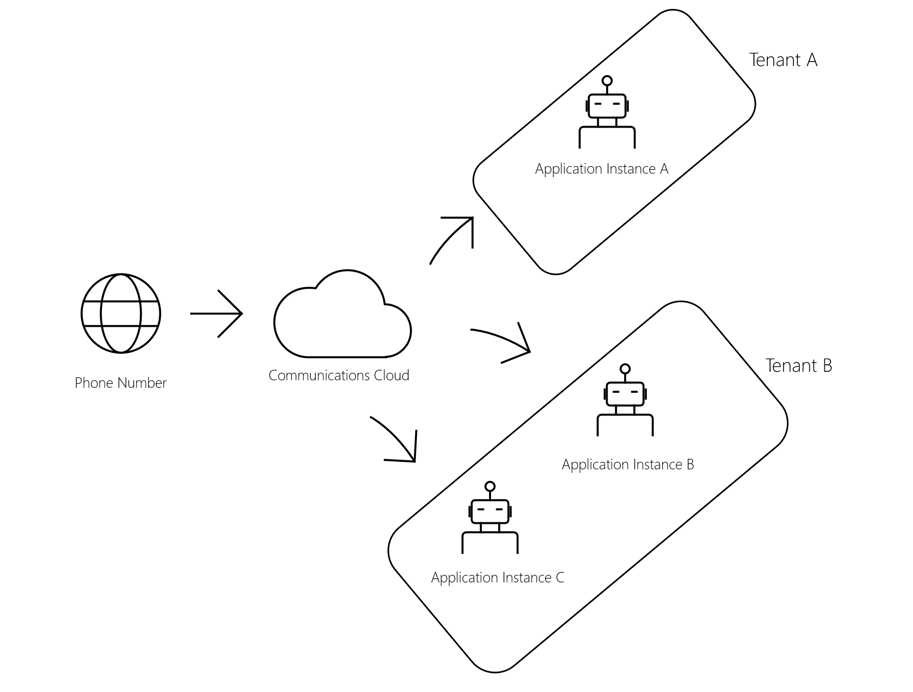

# Управление номерами телефонов для ботов 

В этой статье описывается, как создать робот, достижимый через телефонный номер. По мере создания ленты вам будет полезно ознакомиться со следующими терминами:

- **Приложение** — приложение, размещенное в Azure, которое также называется " **Bot**".

- **Экземпляр приложения** — объект отключенного пользователя, который может быть назначен телефонному номеру, который может использоваться с помощью Bot. Это также называется [учетной записью ресурса](https://docs.microsoft.com/microsoftteams/manage-resource-accounts). Это единственный способ, которым можно назначить номер телефона для ленты.

Одно приложение может иметь несколько экземпляров приложений, и каждый клиент может иметь несколько экземпляров приложения, как показано на следующем рисунке.

## Обязательное требование: регистрация Bot
Чтобы приступить к работе, выполните инструкции по [регистрации абонентского робота](https://microsoftgraph.github.io/microsoft-graph-comms-samples/docs/articles/calls/register-calling-bot.html). Вам понадобятся значения конфигурации, такие как ИДЕНТИФИКАТОРы Bot, идентификатор приложения и пароль Microsoft App, чтобы использовать их в вашем коде.

Добавьте указанные ниже разрешения для ленты. Администратору клиента необходимо также предоставить разрешения для этих разрешений:

- Calls.AccessMedia.All
- Calls.Initiate.All
- Calls.JoinGroupCall.All
- Calls. Жоинграупкалласгуест. ALL

Дополнительные сведения о разрешениях, связанных с вызовами, приведены в статье [References](permissions-reference.md#calls-permissions).

## Назначение номера телефона для ленты

Назначение номера телефона для ленты состоит из трех этапов:

1.  Создайте экземпляр приложения.
2.  Назначьте для экземпляра приложения лицензию виртуального пользователя.
3.  Назначить номер телефона экземпляру приложения (только администратор клиента).

### Создание экземпляра приложения

Если он еще не установлен, администратору клиента необходимо установить [модуль Skype для бизнеса Online](https://www.microsoft.com/download/details.aspx?id=39366) для PowerShell. Перед выполнением командлета администратор клиента должен войти в систему, используя свои учетные данные.

Для создания нового экземпляра приложения администратор клиента выполняет следующий командлет.

`PS C:\> New-CsOnlineApplicationInstance -UserPrincipalName <user@contoso.com> -ApplicationId “<app_id>” -DisplayName "<bot_display_name>"`

При создании экземпляра приложения используйте командлет Sync.

`PS C:\> Sync-CsOnlineApplicationInstance -ObjectId <application_instance_id>`

### Назначение лицензии виртуального пользователя экземпляру приложения

Назначьте для экземпляра приложения лицензию виртуального пользователя. Дополнительную информацию можно узнать в статье [Лицензия виртуального пользователя телефонной системы](https://docs.microsoft.com/microsoftteams/teams-add-on-licensing/virtual-user).

### Назначение номера телефона экземпляру приложения (только администратор клиента)

Чтобы назначить номер телефона экземпляру приложения, аддмин клиента:

1. Вход в центр администрирования Skype для бизнеса в качестве администратора клиента
2. Перейти к**командам** >  **центра** > администрирования и**устаревшему администратору**Skype Skype.
3. Передается на**номера телефонов** **голосовой связи** > 
4. Назначает номер телефона службы (формат 11D) с помощью следующего командлета.

  `PS C:\> Set-CsOnlineVoiceApplicationInstance -Identity <user@contoso.com> -TelephoneNumber <phone_number>`

## Отмена назначения номера телефона для ленты

Используйте следующий командлет, чтобы отменить назначение номера телефона.

`PS C:\> Set-CsOnlineVoiceApplicationInstance -Identity <user@contoso.com> -TelephoneNumber $null`

>**Примечание:** В настоящее время это работает только с номерами в сети, а не с номерами аварийной маршрутизации (DR). Это известная проблема.

## Обновление номера телефона для ленты

После этого вы можете назначить себе другой номер с помощью следующего командлета.

`PS C:\> Set-CsOnlineVoiceApplicationInstance -Identity <user@contoso.com> -TelephoneNumber <new phone_number>`

## См. также

- [Пример ленты для инцидента](https://github.com/microsoftgraph/microsoft-graph-comms-samples/tree/master/Samples/BetaSamples/RemoteMediaSamples/IncidentBot). 
 - Сведения о развертывании можно найти в статье [развертывание примера](https://github.com/microsoftgraph/microsoft-graph-comms-samples/blob/master/Samples/BetaSamples/RemoteMediaSamples/README.md#deploying-the-sample).

