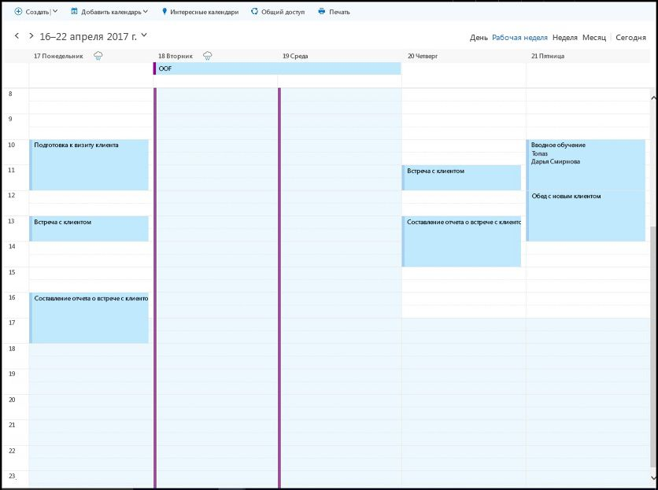

# <a name="find-possible-meeting-times-on-the-outlook-calendar"></a>Поиск времени для проведения собрания в календаре Outlook

В организации или учебном заведении поиск времени и места для проведения собрания часто влечет за собой дополнительные расходы. Приложения Microsoft Graph могут находить интервалы времени для проведения собраний, удовлетворяющие указанным ограничениям, используя действие [findMeetingTimes](../api-reference/v1.0/api/user_findmeetingtimes.md).   

Действие **findMeetingTimes** позволяет указать такие условия, как диапазон времени, продолжительность, обязательные и необязательные участники, а также тип мероприятия (**activityDomain**). Действие учитывает рабочие графики и сведения о доступности участников и организатора и предлагает интервалы времени, которые подходят для участников и типа мероприятия. Например, мероприятия, связанные с работой, всегда предлагается проводить в рабочее время организатора и участников, а собрания, на которых могут присутствовать обязательные участники, располагаются в списке выше.

В Office 365 рабочее время и часовые пояса настраиваются для каждого почтового ящика. Действие **findMeetingTimes** учитывает разницу между часовыми поясами организатора и участников. По умолчанию действие **findMeetingTimes** возвращает предложения в формате UTC. Вы можете использовать следующий заголовок запроса, чтобы действие **findMeetingTimes** показывало предложения в определенном часовом поясе.
```
Prefer: outlook.timezone="{time-zone-string}}"
```

Вы можете указать процент (**minimumAttendeePercentage**) для кворума, чтобы действие **findMeetingTimes** показывало предложения, только если этот минимальный процент участников может присутствовать. Это особенно полезно при планировании больших собраний.

Если действие **findMeetingTimes** не может предложить время проведения собрания, оно указывает конкретную причину (**emptySuggestionsReason**), например, организатор или обязательный участник не может присутствовать. Это значение поможет вам лучше настраивать параметры и снова вызывать метод **findMeetingTimes**.

>**Примечание.** В настоящее время действие **findMeetingTimes** доступно для рабочих и учебных почтовых ящиков Office 365, но не для личных почтовых ящиков outlook.com.

## <a name="example"></a>Пример

В следующем примере показано, как использовать действие **findMeetingTimes**, чтобы найти время для проведения двухчасового собрания двух пользователей, учитывая их сведения о доступности и рабочие графики, а также тот факт, что участник будет временно отсутствовать. Так как это собрание организовывается для двоих, требуется 100-процентное присутствие. Ниже показано расписание пользователей.

### <a name="organizers-calendar"></a>Календарь организатора


### <a name="attendees-calendar"></a>Календарь участника



В примере выполняется 2 вызова **findMeetingTimes**:

1. Первый вызов ищет время для собрания с 18 по 20 апреля. Так как участника не будет на месте 18 и 19 апреля, а 20 апреля свободное время участников не совпадает, первый вызов не возвращает предложений по причине недоступности участников (**emptySuggestionsReason**).
2. Второй вызов ищет время для собрания 21 апреля и предлагает провести его с 14:00 до 16:00.

Два вызова действия **findMeetingTimes** включают следующие параметры. Все [параметры](../api-reference/v1.0/api/user_findmeetingtimes.md#request-body) для действия **findMeetingTimes** являются необязательными.

- **attendees**: один участник, Samantha Booth, для свойства **type** которого задано значение `required`.
- **locationConstraint**: предлагать место не нужно.
- **timeConstraint**: первый вызов просматривает диапазон времени с 9:00 18 апреля до 17:00 20 апреля, после того как он не может предложить время, второй вызов просматривает диапазон времени с 9:00 до 17:00 21 апреля.
- **meetingDuration**: два часа.
- **returnSuggestionReasons**: в этом примере требуется показать причину для каждого предложения.
- **minimumAttendeePercentage**: 100 %, так как участник должен быть свободен в любое предложенное время.

### <a name="first-request"></a>Первый запрос

Поиск 2-часового интервала 18–20 апреля, в течение которого оба пользователя будут свободны.

<!-- {
  "blockType": "request",
  "name": "findmeetingtimes_example_first"
}-->
```http
POST https://graph.microsoft.com/v1.0/me/findMeetingTimes
Prefer: outlook.timezone="Pacific Standard Time"
Content-type: application/json

{ 
  "attendees": [ 
    { 
      "type": "required",  
      "emailAddress": { 
        "name": "Samantha Booth",
        "address": "samanthab@contoso.onmicrosoft.com" 
      } 
    }
  ],  
  "locationConstraint": { 
    "isRequired": "false",  
    "suggestLocation": "false",  
    "locations": [ 
      { 
        "resolveAvailability": "false",
        "displayName": "Conf room Hood" 
      } 
    ] 
  },  
  "timeConstraint": {
    "activityDomain":"work", 
    "timeslots": [ 
      { 
        "start": { 
          "dateTime": "2017-04-18T09:00:00",  
          "timeZone": "Pacific Standard Time" 
        },  
        "end": { 
          "dateTime": "2017-04-20T17:00:00",  
          "timeZone": "Pacific Standard Time" 
        } 
      } 
    ] 
  },  
  "meetingDuration": "PT2H",
  "returnSuggestionReasons": "true",
  "minimumAttendeePercentage": "100"
}
```

### <a name="first-response"></a>Первый ответ
В рабочее время 18–20 апреля 2-часовый интервал, в течение которого оба пользователя будут свободны, отсутствует.
<!-- {
  "blockType": "response",
  "truncated": true,
  "@odata.type": "microsoft.graph.meetingTimeSuggestionsResult",
  "isCollection": false
} -->
```http
HTTP/1.1 200 OK
Content-type: application/json
Preference-Applied: outlook.timezone="Pacific Standard Time"
Content-Length: 184

{
    "@odata.context":"https://graph.microsoft.com/v1.0/$metadata#microsoft.graph.meetingTimeSuggestionsResult",
    "emptySuggestionsReason":"AttendeesUnavailable",
    "meetingTimeSuggestions":[

    ]
}
```

### <a name="second-request"></a>Второй запрос
Поиск 2-часового интервала 21 апреля.
<!-- {
  "blockType": "request",
  "name": "findmeetingtimes_example_second"
}-->
```http
POST https://graph.microsoft.com/v1.0/me/findMeetingTimes
Prefer: outlook.timezone="Pacific Standard Time"
Content-type: application/json

{ 
  "attendees": [ 
    { 
      "type": "required",  
      "emailAddress": { 
        "name": "Samantha Booth",
        "address": "samanthab@contoso.onmicrosoft.com" 
      } 
    }
  ],  
  "locationConstraint": { 
    "isRequired": "false",  
    "suggestLocation": "false",  
    "locations": [ 
      { 
        "resolveAvailability": "false",
        "displayName": "Conf room Hood" 
      } 
    ] 
  },  
  "timeConstraint": {
    "activityDomain":"work", 
    "timeslots": [ 
      { 
        "start": { 
          "dateTime": "2017-04-21T09:00:00",  
          "timeZone": "Pacific Standard Time" 
        },  
        "end": { 
          "dateTime": "2017-04-21T17:00:00",  
          "timeZone": "Pacific Standard Time" 
        } 
      } 
    ] 
  },  
  "meetingDuration": "PT2H",
  "returnSuggestionReasons": "true",
  "minimumAttendeePercentage": "100"
}
```

### <a name="second-response"></a>Второй ответ
Второй запрос **findMeetingTimes** предлагает пользователям провести собрание 21 апреля с 14:00 до 16:00.
<!-- {
  "blockType": "response",
  "truncated": true,
  "@odata.type": "microsoft.graph.meetingTimeSuggestionsResult",
  "isCollection": false
} -->
```http
HTTP/1.1 200 OK
Content-type: application/json
Preference-Applied: outlook.timezone="Pacific Standard Time"
Content-Length: 714

{
    "@odata.context":"https://graph.microsoft.com/v1.0/$metadata#microsoft.graph.meetingTimeSuggestionsResult",
    "emptySuggestionsReason":"",
    "meetingTimeSuggestions":[
        {
            "confidence":100.0,
            "organizerAvailability":"free",
            "suggestionReason":"Suggested because it is one of the nearest times when all attendees are available.",
            "meetingTimeSlot":{
                "start":{
                    "dateTime":"2017-04-21T14:00:00.0000000",
                    "timeZone":"Pacific Standard Time"
                },
                "end":{
                    "dateTime":"2017-04-21T16:00:00.0000000",
                    "timeZone":"Pacific Standard Time"
                }
            },
            "attendeeAvailability":[
                {
                    "availability":"free",
                    "attendee":{
                        "type":"required",
                        "emailAddress":{
                            "address":"samanthab@contoso.onmicrosoft.com"
                        }
                    }
                }
            ],
            "locations":[
                {
                    "displayName":"Conf room Hood"
                }
            ]
        }
    ]
}
```


## <a name="next-steps"></a>Дальнейшие действия

Иногда не все участники могут присутствовать на собрании. Указав необязательный параметр **minimumAttendeePercentage**, вы можете сделать так, чтобы действие **findMeetingTimes** предлагало время, только если _вероятность_ присутствия всех участников достигает определенного процента. Узнайте больше о [достоверности предложения](../api-reference/v1.0/api/user_findmeetingtimes.md#the-confidence-of-a-meeting-suggestion) и других [параметрах](../api-reference/v1.0/api/user_findmeetingtimes.md#request-body) и применяйте их для больших собраний.

Получив предложения по времени проведения собрания, вы можете:

1. [создать событие и отправить приглашение на собрание](../api-reference/v1.0/api/user_post_events.md); 
2. [добавить вложение](../api-reference/v1.0/api/event_post_attachments.md) в событие.
