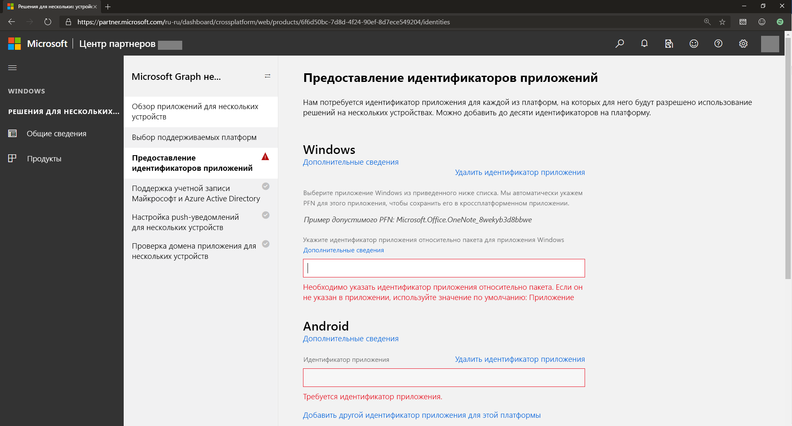
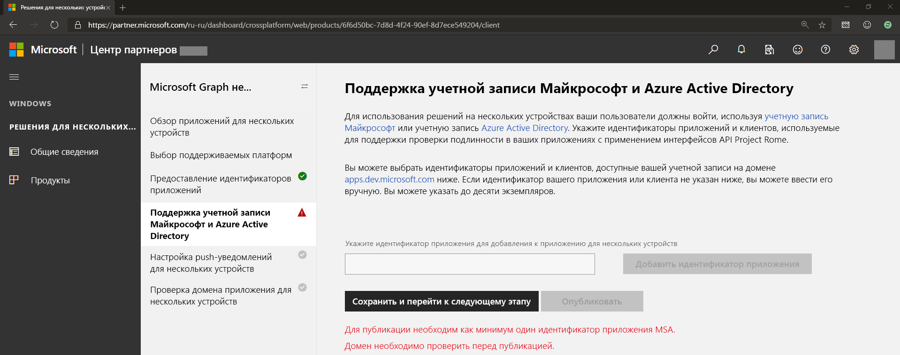
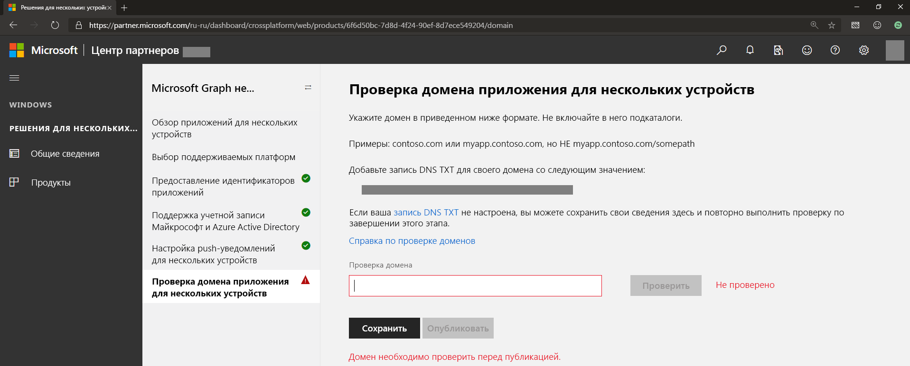

# Внедрение использования разных устройств для уведомлений Microsoft GraphOnboarding to cross-device experiences for Microsoft Graph notifications

В дополнение к [регистрации приложения на портале Azure](notifications-integration-app-registration.md) для вашего приложения требуется зарегистрировать сведения о применении на разных устройствах, например идентификатор кроссплатформенного приложения и учетные данные кроссплатформенных push-уведомлений, чтобы разрешить Microsoft Graph отправлять уведомления через собственные службы push-уведомлений, соответствующие операционной системе: Windows, iOS и Android.In addition to [app registration on Azure Portal](notifications-integration-app-registration.md), your application needs to register cross-device information such as cross-platform application id and cross-platform push credentials in order to authorizes Microsoft Graph to send notifications via native push notification services that correspond to each operating system: Windows, iOS, and Android. Это выполняется в [панели мониторинга Центра партнеров (прежнее название — информационная панель Центра разработки для Windows)](https://partner.microsoft.com/dashboard/).This is done through [Partner Center dashboard (formerly Windows Dev Center dashboard)](https://partner.microsoft.com/dashboard/). 

> [!NOTE]
> Если у вас еще нет учетной записи разработчика Windows, вам потребуется ее создать.If you don’t already have a Windows developer account, you’ll need to create one. Дополнительные сведения см. в статье [Создание учетной записи разработчика](https://docs.microsoft.com/en-us/windows/uwp/publish/opening-a-developer-account).For details, see [Opening a developer account](https://docs.microsoft.com/en-us/windows/uwp/publish/opening-a-developer-account). Вам потребуется это сделать, даже если вы не планируете создавать приложения UWP Windows.You need to do this even if you don’t plan to build a Windows UWP application. Если вы создаете учебное или рабочее приложение в рамках организации, можно связать учетную запись разработчика с соответствующей учетной записью Azure AD, используемой для управления корпоративной отправкой.If you’re building a school or work application as part of an enterprise, you can associate your developer account with the appropriate Azure AD account that is used for managing your enterprise submissions. Дополнительные сведения см. в статье [Связывание Azure Active Directory с учетной записью Центра партнеров](https://docs.microsoft.com/en-us/windows/uwp/publish/associate-azure-ad-with-partner-center).For details, see [Associate Azure Active Directory with your Partner Center account](https://docs.microsoft.com/en-us/windows/uwp/publish/associate-azure-ad-with-partner-center).

Чтобы приступить к работе, выполните вход в [панели мониторинга Центра партнеров](https://partner.microsoft.com/en-us/dashboard), используя свою учетную запись разработчика Windows (нельзя использовать учетную запись Azure AD):To get started, sign in to the [Partner Center dashboard](https://partner.microsoft.com/en-us/dashboard) using your Windows developer account (you cannot use an Azure AD account):

1.  В меню слева перейдите в раздел **Работа на разных устройствах**, выберите **Настройка нового приложения для разных устройств** и укажите имя приложения, как показано на снимке экрана ниже.On the left menu, go to **Cross-Device Experiences**, select **Configuring a new cross-device app**, and provide your app name, as shown in the following screenshot.

2.  Выберите все поддерживаемые платформы, на которых будет применяться и сможет получать уведомления ваше приложение.Select all supported platforms where your app will have a presence and be enabled to receive notifications. Вы можете выбрать поддерживаемые платформы, включающие Windows, Android и iOS, как показано ниже.You can select from supported platforms that include Windows, Android, and iOS, as shown. 

3.  Укажите идентификаторы приложения для каждой платформы, на которой будет применяться ваше приложение, как показано ниже.Provide app IDs for each of the platforms where your app has a presence, as shown.

 

> [!NOTE] 
> Вы можете добавлять разные идентификаторы (до десяти) для каждой платформы на случай наличия нескольких версий одного приложения или разных приложений, которым нужна возможность получения одинаковых уведомлений, отправляемых вашим сервером приложений и предназначенных для одного пользователя.You can add different IDs (up to ten) per platform – this is in case you have multiple versions of the same app, or even different apps, that want to be able to receive the same notification sent by your app server and targeted to the same user.

4.  Укажите или выберите идентификатор приложения из учетной записи Майкрософт и/или регистрации приложения Azure AD.Provide or select the app ID from Microsoft account and/or Azure AD app registration. Этот идентификатор клиента соответствует сведениям учетной записи Майкрософт или регистрации приложения Azure AD, полученным при регистрации на портале Azure.This client ID corresponds to the Microsoft account or Azure AD app registration that you obtained when you register in the Azure Portal.

5.  Уведомления Microsoft Graph используют каждую из собственных платформ уведомлений на всех основных платформах для отправки уведомлений в конечные точки клиента приложения, а именно: WNS (для UWP Windows), FCM (для Android) и APNS (для iOS).Microsoft Graph notifications use each of the native notification platforms on all major platforms to send notifications to the app client endpoints, namely, WNS (for Windows UWP), FCM (for Android), and APNS (for iOS). Предоставьте свои учетные данные для этих платформ уведомлений, чтобы разрешить службе уведомлений Microsoft Graph доставлять уведомления для вашего сервера приложений, когда вы публикуете уведомления, ориентированные на пользователя, как показано ниже.Provide your credentials for these notification platforms to enable Microsoft Graph notifications to deliver notifications for your app server when you publish user-targeted notifications, as shown.

 

> [!NOTE]
> Для приложений UWP Windows включение push-уведомлений WNS является необходимым условием для использования уведомлений Microsoft Graph.For Windows UWP apps, enabling WNS push notification is a prerequisite to using Microsoft Graph notifications. Дополнительные сведения см. в статье [Обзор WNS](https://docs.microsoft.com/en-us/windows/uwp/design/shell/tiles-and-notifications/windows-push-notification-services--wns--overview).For details, see [WNS overview](https://docs.microsoft.com/en-us/windows/uwp/design/shell/tiles-and-notifications/windows-push-notification-services--wns--overview). После внедрения вы сможете предоставлять учетные данные push-уведомлений через Центр партнеров для платформы подключенных устройств.After you onboard, you can provide push credentials via Partner Center to the Connected Device Platform.

6.  Проверьте домен приложения для разных устройств. Это служит процедурой проверки, подтверждающей, что ваше приложение владеет этим доменом.Verify your cross-device app domain, which serves as a verification process to prove that your application has ownership of this domain. Для зарегистрированного вами приложения или приложений это является удостоверением приложения на разных устройствах, как показано ниже.This acts like a cross-device app identity for the application or applications you registered, as shown.
    
    

Готово!That’s it! Вы зарегистрировали свои приложения для получения уведомлений.You've now registered your applications to receive notifications. Затем добавьте [пакет SDK уведомлений Microsoft Graph](https://github.com/microsoft/project-rome) в свой проект для выбранной платформы и начните интеграцию.Next, add the [Microsoft Graph notifications SDK](https://github.com/microsoft/project-rome) to your project on your platform of choice and start integrating. 
