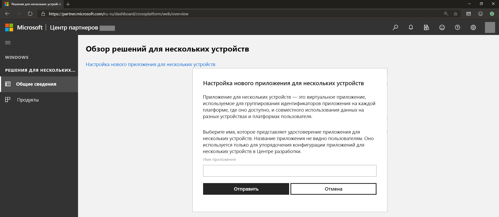

# Внедрение использования разных устройств для уведомлений Microsoft Graph

В дополнение к [регистрации приложения на портале Azure](notifications-integration-app-registration.md) для вашего приложения требуется зарегистрировать сведения о применении на разных устройствах, например идентификатор кроссплатформенного приложения и учетные данные кроссплатформенных push-уведомлений, чтобы разрешить Microsoft Graph отправлять уведомления через собственные службы push-уведомлений, соответствующие операционной системе: Windows, iOS и Android. Это выполняется в [панели мониторинга Центра партнеров (прежнее название — информационная панель Центра разработки для Windows)](https://partner.microsoft.com/dashboard/). 

> [!NOTE]
> Если у вас еще нет учетной записи разработчика Windows, вам потребуется ее создать. Дополнительные сведения см. в статье [Создание учетной записи разработчика](https://docs.microsoft.com/ru-RU/windows/uwp/publish/opening-a-developer-account). Вам потребуется это сделать, даже если вы не планируете создавать приложения UWP Windows. Если вы создаете учебное или рабочее приложение в рамках организации, можно связать учетную запись разработчика с соответствующей учетной записью Azure AD, используемой для управления корпоративной отправкой. Дополнительные сведения см. в статье [Связывание Azure Active Directory с учетной записью Центра партнеров](https://docs.microsoft.com/ru-RU/windows/uwp/publish/associate-azure-ad-with-partner-center).

Чтобы приступить к работе, выполните вход в [панели мониторинга Центра партнеров](https://partner.microsoft.com/en-us/dashboard), используя свою учетную запись разработчика Windows (нельзя использовать учетную запись Azure AD):

1.  В меню слева перейдите в раздел **Работа на разных устройствах**, выберите **Настройка нового приложения для разных устройств** и укажите имя приложения, как показано на снимке экрана ниже.

2.  Выберите все поддерживаемые платформы, на которых будет применяться и сможет получать уведомления ваше приложение. Вы можете выбрать поддерживаемые платформы, включающие Windows, Android и iOS, как показано ниже. 

3.  Укажите идентификаторы приложения для каждой платформы, на которой будет применяться ваше приложение, как показано ниже.

 

> [!NOTE] 
> Вы можете добавлять разные идентификаторы (до десяти) для каждой платформы на случай наличия нескольких версий одного приложения или разных приложений, которым нужна возможность получения одинаковых уведомлений, отправляемых вашим сервером приложений и предназначенных для одного пользователя.

4.  Укажите или выберите идентификатор приложения из учетной записи Майкрософт и/или регистрации приложения Azure AD. Этот идентификатор клиента соответствует сведениям учетной записи Майкрософт или регистрации приложения Azure AD, полученным при регистрации на портале Azure.

5.  Уведомления Microsoft Graph используют каждую из собственных платформ уведомлений на всех основных платформах для отправки уведомлений в конечные точки клиента приложения, а именно: WNS (для UWP Windows), FCM (для Android) и APNS (для iOS). Предоставьте свои учетные данные для этих платформ уведомлений, чтобы разрешить службе уведомлений Microsoft Graph доставлять уведомления для вашего сервера приложений, когда вы публикуете уведомления, ориентированные на пользователя, как показано ниже.

 

> [!NOTE]
> Для приложений UWP Windows включение push-уведомлений WNS является необходимым условием для использования уведомлений Microsoft Graph. Дополнительные сведения см. в статье [Обзор WNS](https://docs.microsoft.com/ru-RU/windows/uwp/design/shell/tiles-and-notifications/windows-push-notification-services--wns--overview). После внедрения вы сможете предоставлять учетные данные push-уведомлений через Центр партнеров для платформы подключенных устройств.

6.  Проверьте домен приложения для разных устройств. Это служит процедурой проверки, подтверждающей, что ваше приложение владеет этим доменом. Для зарегистрированного вами приложения или приложений это является удостоверением приложения на разных устройствах, как показано ниже.
    
    

Готово! Вы зарегистрировали свои приложения для получения уведомлений. Затем добавьте [пакет SDK уведомлений Microsoft Graph](https://github.com/microsoft/project-rome) в свой проект для выбранной платформы и начните интеграцию. 
