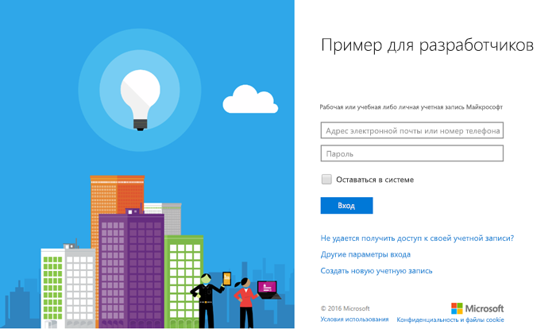

# <a name="get-started-with-microsoft-graph-in-a-php-app"></a>Начало работы с Microsoft Graph в приложении PHP

В этой статье описываются задачи, которые необходимо выполнить, чтобы получить маркер доступа из конечной точки Azure AD версии 2.0 и вызвать Microsoft Graph. В ней рассматривается создание [приложения Connect для PHP (REST)](https://github.com/microsoftgraph/php-connect-rest-sample) и объясняются основные понятия, которые необходимо реализовать для использования Microsoft Graph. Кроме того, в этой статье рассказывается, как получить доступ к Microsoft Graph с помощью вызовов REST.

Чтобы использовать Microsoft Graph в приложении PHP, необходимо предоставить пользователям страницу входа в учетную запись Майкрософт. На приведенном ниже снимке экрана показана страница входа в учетную запись Майкрософт.



**Не хотите создавать приложение?** Скачайте [приложение Connect для PHP (REST)](https://github.com/microsoftgraph/php-connect-rest-sample), на котором основана эта статья, и вы будете готовы к работе. Или попробуйте [приложение Connect для PHP (SDK)](https://github.com/microsoftgraph/php-connect-sample), использующее [библиотеку Microsoft Graph для PHP](https://github.com/microsoftgraph/msgraph-sdk-php) (предварительная версия).


## <a name="prerequisites"></a>Необходимые условия

Чтобы приступить к работе, вам понадобится следующее: 

- [Учетная запись Майкрософт](https://www.outlook.com/) либо [рабочая или учебная учетная запись](http://dev.office.com/devprogram).
- PHP версии 5.5.9 или выше.
- [Композитор](https://getcomposer.org/).


## <a name="register-the-application"></a>Регистрация приложения
Зарегистрируйте приложение на портале регистрации приложений Майкрософт. При этом будут созданы идентификатор и пароль приложения, которые понадобятся при его настройке.

1. Войдите на [портал регистрации приложений Майкрософт](https://apps.dev.microsoft.com/) с помощью личной, рабочей или учебной учетной записи.

2. Нажмите кнопку **Добавить приложение**.

3. Введите имя приложения и нажмите кнопку **Создать приложение**. 
    
    Откроется страница регистрации со свойствами приложения.

4. Нажмите **Создать новый пароль**.

5. Скопируйте идентификатор и пароль приложения.

6. Нажмите кнопку **Добавление платформы** и выберите **Веб**.

7. В поле **URI перенаправления** введите `http://localhost:8000/oauth`.

8. Нажмите кнопку **Сохранить**.


## <a name="configure-the-project"></a>Настройка проекта

Создайте проект с помощью композитора. Чтобы создать проект PHP с помощью платформы Laravel, используйте следующую команду:

```bash
composer create-project --prefer-dist laravel/laravel getstarted
```
 
Будет создана папка **getstarted**, которую можно использовать для этого проекта.

> Примечание. Вы также можете использовать [начальный проект](https://github.com/microsoftgraph/php-connect-rest-sample/tree/master/starter-project) с готовой конфигурацией, чтобы сосредоточиться на программировании.

## <a name="authenticate-the-user-and-get-an-access-token"></a>Проверка подлинности пользователя и получение маркера доступа
Для упрощения проверки подлинности мы будем использовать библиотеку OAuth. [PHP League](http://thephpleague.com/) предоставляет [клиентскую библиотеку OAuth](https://github.com/thephpleague/oauth2-client), которую можно использовать в этом проекте.

### <a name="add-the-dependency-to-composer"></a>Добавление зависимости в композитор

Откройте файл `composer.json` и добавьте следующую зависимость в разделе **require**:

```json
"league/oauth2-client": "^1.4"
```

Обновите зависимости, выполнив следующую команду:

```bash
composer update
```

### <a name="start-the-authentication-flow"></a>Запуск потока проверки подлинности

1. Откройте файл **resources** > **views** > **welcome.blade.php**. Замените элемент div **title** приведенным ниже кодом.
    ```html
    <div class="title" onClick="window.location='/oauth'">Sign in to Microsoft</div>
    ```
    
2. Добавьте подсказку типа для класса `Illuminate\Http\Request` в файле **app** > **Http** > **routes.php**. Добавляйте приведенную ниже строку перед каждым объявлением маршрута.
    ```php
    use Illuminate\Http\Request;
    ```
    
3. Добавьте маршрут */oauth* в файл **app** > **Http** > **routes.php**. Чтобы добавить маршрут, вставьте приведенный ниже код после объявления маршрута по умолчанию. Вставьте **идентификатор приложения** и **пароль** вместо заполнителей **\<YOUR_APPLICATION_ID\>** и **\<YOUR_PASSWORD\>** соответственно.
    ```php
    Route::get('/oauth', function () {
        $provider = new \League\OAuth2\Client\Provider\GenericProvider([
            'clientId'                => '<YOUR_APPLICATION_ID>',
            'clientSecret'            => '<YOUR_PASSWORD>',
            'redirectUri'             => 'http://localhost:8000/oauth',
            'urlAuthorize'            => 'https://login.microsoftonline.com/common/oauth2/v2.0/authorize',
            'urlAccessToken'          => 'https://login.microsoftonline.com/common/oauth2/v2.0/token',
            'urlResourceOwnerDetails' => '',
            'scopes'                  => 'openid mail.send'
        ]);

        if (!$request->has('code')) {
            return redirect($provider->getAuthorizationUrl());
        }
    });
    ```
    
На этом этапе у вас должно получиться приложение PHP, отображающее страницу *входа в учетную запись Майкрософт*. Если нажать текст, приложение откроет страницу входа в учетную запись Майкрософт. Теперь необходимо обработать код, отправляемый сервером авторизации на URI перенаправления, и обменять его на маркер доступа.

### <a name="exchange-the-authorization-code-for-an-access-token"></a>Обмен кода авторизации на маркер доступа

Необходимо обработать ответ сервера авторизации, содержащий код, который можно обменять на маркер доступа.

Измените маршрут */oauth* так, чтобы приложение могло получать маркер доступа с помощью кода авторизации. Для этого откройте файл **app** > **Http** > **routes.php** и добавьте условное предложение *else* к оператору *if*.

```php
if (!$request->has('code')) {
    ...
    // add the following lines
} else {
    $accessToken = $provider->getAccessToken('authorization_code', [
        'code'     => $request->input('code')
    ]);
    exit($accessToken->getToken());
}
```
    
Обратите внимание, что маркер доступа содержится в строке `exit($accessToken->getToken());`. Теперь вы готовы добавить код для вызова Microsoft Graph. 

## <a name="call-microsoft-graph-using-rest"></a>Вызов Microsoft Graph с помощью REST
Microsoft Graph можно вызвать с помощью REST. Замените строку `exit($accessToken->getToken());` приведенным ниже кодом. Вставьте свой адрес электронной почты вместо заполнителя **\<YOUR_EMAIL_ADDRESS\>**.

```php
$client = new \GuzzleHttp\Client();

$email = "{
    Message: {
    Subject: 'Sent using the Microsoft Graph REST API',
    Body: {
        ContentType: 'text',
        Content: 'This is the email body'
    },
    ToRecipients: [
        {
            EmailAddress: {
            Address: '<YOUR_EMAIL_ADDRESS>'
            }
        }
    ]
    }}";

$response = $client->request('POST', 'https://graph.microsoft.com/v1.0/me/sendmail', [
    'headers' => [
        'Authorization' => 'Bearer ' . $accessToken->getToken(),
        'Content-Type' => 'application/json;odata.metadata=minimal;odata.streaming=true'
    ],
    'body' => $email
]);
if($response.getStatusCode() === 201) {
    exit('Email sent, check your inbox');
} else {
    exit('There was an error sending the email. Status code: ' . $response.getStatusCode());
}
```

## <a name="run-the-app"></a>Запуск приложения
Теперь вы можете испытать свое приложение PHP.

1. В командной консоли введите следующую команду:
    ```bash
    php artisan serve
    ```
    
2. Введите адрес `http://localhost:8000` в веб-браузере.
3. Нажмите **Войти в учетную запись Майкрософт**.
4. Войдите с помощью личной, рабочей или учебной учетной записи и предоставьте необходимые разрешения.

Проверьте папку "Входящие" в почтовом ящике, выбранном в разделе [Вызов Microsoft Graph с помощью REST](#call-microsoft-graph-using-rest). Вы должны получить сообщение от учетной записи, которая использовалась для входа в приложение.

## <a name="next-steps"></a>Дальнейшие действия
- Попробуйте [песочницу Microsoft Graph](https://graph.microsoft.io/graph-explorer).


## <a name="see-also"></a>См. также
* [Протоколы Azure AD версии 2.0](https://azure.microsoft.com/en-us/documentation/articles/active-directory-v2-protocols/)
* [Маркеры Azure AD версии 2.0](https://azure.microsoft.com/en-us/documentation/articles/active-directory-v2-tokens/)
