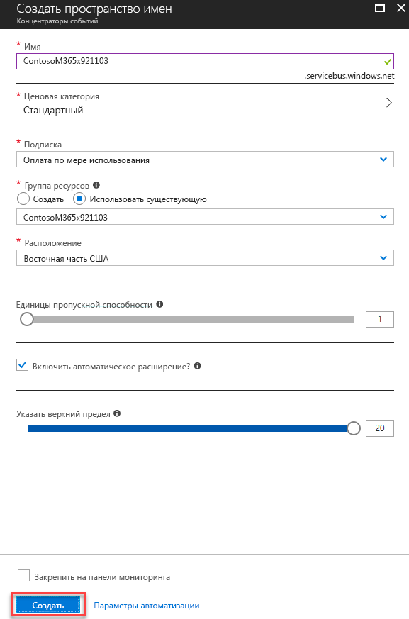
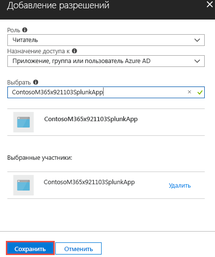
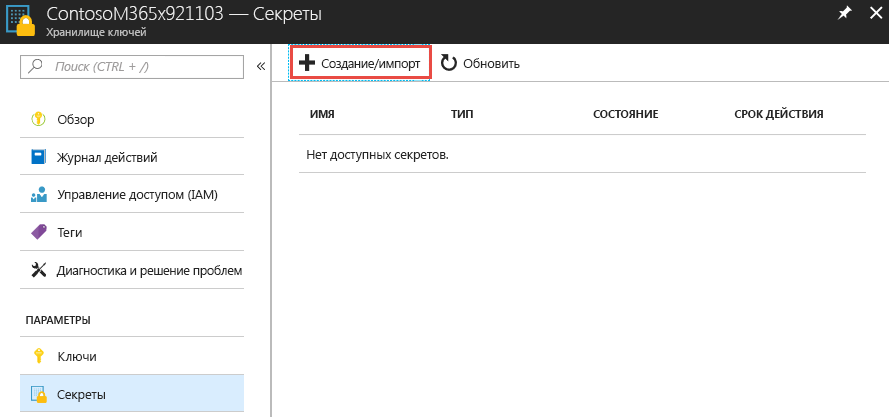

# <a name="integrate-microsoft-graph-security-api-alerts-with-your-siem-using-azure-monitor"></a>Интеграция оповещений API безопасности Microsoft Graph с SIEM при помощи Azure Monitor

Поставщиками безопасности Microsoft Graph можно управлять через одну конечную точку REST. Эту конечную точку можно настроить для службы [Azure Monitor](https://docs.microsoft.com/ru-RU/azure/monitoring-and-diagnostics/), поддерживающей соединители для нескольких продуктов SIEM. Инструкции, приведенные в этапах 1 и 2 этой статьи, относятся ко всем соединителям Azure Monitor, поддерживающим получение данных через концентраторы событий. В этой статье описана сквозная интеграция соединителя [Splunk](https://splunkbase.splunk.com/) SIEM.

Процесс интеграции состоит из следующих этапов:

1. [Настройка концентратора событий Azure на получение оповещений системы безопасности для клиента](#step-1-set-up-an-event-hubs-namespace-in-azure-to-receive-security-alerts-for-your-tenant)
2. [Настройка Azure Monitor на отправку оповещений системы безопасности из клиента в концентратор событий](#step-2-configure-azure-monitor-to-send-security-alerts-from-your-tenant-to-the-event-hub)
3. [Скачивание и установка надстройки Azure Monitor для Splunk, с помощью которой Splunk может получать оповещения системы безопасности](#step-3-download-and-install-the-azure-monitor-add-on-for-splunk-which-will-allow-splunk-to-consume-security-alerts)
4. [Регистрация приложения в клиенте Azure Active Directory, с помощью которого Splunk будет считывать данные из концентратора событий](#step-4-register-an-application-with-your-tenant-azure-active-directory-which-splunk-will-use-to-read-from-the-event-hub )
5. [Создание хранилища Azure Key Vault для хранения ключа доступа к концентратору событий](#step-5-create-an-azure-key-vault-to-store-the-access-key-for-the-event-hub)
6. [Настройка каналов входных данных Splunk на получение оповещений системы безопасности, хранящихся в концентраторе событий](#step-6-configure-the-splunk-data-inputs-to-consume-security-alerts-stored-in-the-event-hub)

После выполнения этих действий Splunk Enterprise будет получать оповещения системы безопасности от всех интегрированных с Microsoft Graph средств обеспечения безопасности, лицензии на которые есть в клиенте. Все новые лицензированные средства обеспечения безопасности также будут отправлять оповещения через это соединение по той же схеме. Дополнительная интеграция не требуется.

## <a name="step-1-set-up-an-event-hubs-namespace-in-azure-to-receive-security-alerts-for-your-tenant"></a>Этап 1. Настройка пространства имен для концентраторов событий в Azure на получение оповещений системы безопасности для клиента

Для начала необходимо создать пространство имен [концентраторов событий Microsoft Azure](https://docs.microsoft.com/ru-RU/azure/event-hubs/) и концентратор событий. Это пространство имен и концентратор событий будут пунктом назначения для всех оповещений системы безопасности в организации. Пространство имен концентраторов событий — это логическая группа концентраторов событий с одной и той же политикой доступа. Обратите внимание на несколько особенностей этого пространства имен и создаваемых вами концентраторов событий.

- Рекомендуем использовать стандартное пространство имен концентраторов событий, особенно при отправке других данных мониторинга Azure через те же концентраторы событий.
- Как правило, требуется только одна единица пропускной способности. Если активность использования концентратора повысится, вы можете вручную увеличивать количество единиц пропускной способности для пространства имен или включить автоматическое расширение.
- Количество единиц пропускной способности позволяет повышать масштаб пропускной способности для концентраторов событий. Путем изменения количества разделов вы можете параллелизовать потребление для множества пользователей. Скорость одного раздела может достигать 20 МБ/с или приблизительно 20 000 сообщений в секунду. Поддержка получения данных из нескольких разделов зависит от того, какое средство получает данные. Если вы не уверены, сколько разделов следует создать, рекомендуем начать с четырех.
- Рекомендуем задать для концентратора событий срок хранения сообщений, составляющий 7 дней. Благодаря этому, если средство получения данных выйдет из строя более чем на день, оно сможет продолжить работу с того же момента (для событий не старше 7 дней).
- Рекомендуем использовать для концентратора событий группу потребителей по умолчанию. Создавать другие группы потребителей или использовать отдельную группу не требуется, если вы не планируете получать данные из одного концентратора событий с помощью двух разных средств.
- Как правило, на компьютере, получающем данные из концентратора событий, должны быть открыты порты 5671 и 5672.

См. также: [Часто задаваемые вопросы о концентраторах событий в Azure](https://docs.microsoft.com/ru-RU/azure/event-hubs/event-hubs-faq).

1. Войдите на [портал Azure](https://portal.azure.com/) и нажмите **Создать ресурс** в левой верхней части экрана.

    

2. Выберите **"Интернет вещей"**, а затем — **Концентраторы событий**.

    

3. В поле **Создать пространство имен** введите имя пространства имен. Убедившись, что имя пространства имен доступно, выберите ценовую категорию (базовую или стандартную). Кроме того, выберите подписку Azure, группу ресурсов и расположение для создания ресурса. Нажмите кнопку **Создать**, чтобы создать пространство имен. Возможно, вам потребуется подождать несколько минут, чтобы система полностью подготовила ресурсы.

    

## <a name="step-2-configure-azure-monitor-to-send-security-alerts-from-your-tenant-to-the-event-hub"></a>Этап 2. Настройка Azure Monitor на отправку оповещений системы безопасности из клиента в концентратор событий

Достаточно один раз включить потоковую передачу оповещений от системы безопасности организации через Azure Monitor для всего клиента Azure Active Directory (Azure AD). Все продукты с поддержкой и лицензией на API безопасности Microsoft Graph начнут отправлять оповещения системы безопасности в Azure Monitor, выполняя потоковую передачу данных принимающим приложениям. Все остальные продукты с поддержкой API безопасности Microsoft Graph, лицензированные и развернутые в организации, автоматически начнут потоковую передачу оповещений системы безопасности с использованием той же конфигурации Azure Monitor. От организации не потребуется дополнительных действий по интеграции.

Оповещения системы безопасности обладают широкими правами, и их обычно могут просматривать только сотрудники групп реагирования и глобальные администраторы организации. По этой причине, чтобы настроить интеграцию оповещений системы безопасности в клиенте с системами SIEM, необходима учетная запись глобального администратора Azure AD. Эта учетная запись потребуется только один раз, во время настройки, чтобы запросить отправку оповещений от службы безопасности организации в Azure Monitor.

> **Примечание.** В настоящее время колонка параметров диагностики в Azure Monitor не поддерживает настройку ресурсов на уровне клиента. Оповещения API безопасности Microsoft Graph являются ресурсом на уровне клиента, что требует использования API Azure Resource Manager, чтобы настроить Azure Monitor на поддержку получения оповещений от системы безопасности организации.

1. В подписке Azure зарегистрируйте "microsoft.insights" (Azure Monitor) в качестве поставщика ресурсов.  
 > **Примечание.** Не указывайте "Microsoft.SecurityGraph" (API безопасности Microsoft Graph) в качестве поставщика ресурсов в своей подписке Azure, поскольку "Microsoft.SecurityGraph" является ресурсом на уровне клиента, как указано выше. Настройка на уровне клиента рассматривается в п. 6 ниже.

2. Чтобы настроить Azure Monitor с помощью API Azure Resource Manager, приобретите средство [ARMClient](https://github.com/projectkudu/ARMClient). С его помощью можно отправлять вызовы REST API на портал Azure из командной строки.

3. Подготовьте примерно такой файл JSON с запросом параметров диагностики:

<!-- {
  "blockType": "ignored"
} -->

    ``` json
    {
      "location": "",
      "properties": {
        "name": "securityApiAlerts",
        "serviceBusRuleId": "/subscriptions/SUBSCRIPTION_ID/resourceGroups/RESOURCE_GROUP/providers/Microsoft.EventHub/namespaces/EVENT_HUB_NAMESPACE/authorizationrules/RootManageSharedAccessKey",
        "logs": [
          {
            "category": "Alert",
            "enabled": true,
            "retentionPolicy": {
              "enabled": true,
              "days": 7
            }
          }
        ]
      }
    }
    ```

  Замените значения в файле JSON, как указано ниже.

  * **SUBSCRIPTION_ID** — это ИД подписки Azure, где размещаются группа ресурсов и пространство имен концентраторов событий, в которые будут отправляться оповещения системы безопасности из вашей организации.
  * **RESOURCE_GROUP** — это группа ресурсов, содержащая пространство имен концентраторов событий, в которое будут отправляться оповещения системы безопасности из вашей организации.
  * **EVENT_HUB_NAMESPACE** — это пространство концентраторов событий, в которое будут отправляться оповещения системы безопасности из вашей организации.
  * **"days"** — это количество дней, в течение которого в концентраторе событий будут храниться сообщения.
  
&nbsp;
4. Сохраните файл в формате JSON в том же каталоге, где будет запускаться программа ARMClient.exe. Например, назовите файл **AzMonConfig.json.**

5. Выполните приведенную ниже команду, чтобы войти в средство ARMClient. Необходимо использовать учетные данные глобального администратора.

    ``` shell
    ARMClient.exe login
    ```

6. Выполните приведенную ниже команду, чтобы настроить Azure Monitor на отправку оповещений системы безопасности в пространство имен концентраторов событий. При этом в пространстве имен будет автоматически подготовлен концентратор событий, в который будет запущен поток оповещений системы безопасности. Убедитесь, что имя параметра (в данном примере — **securityApiAlerts**) совпадает с указанным в поле **name** JSON-файла.

    ``` shell
    ARMClient.exe put https://management.azure.com/providers/Microsoft.SecurityGraph/diagnosticSettings/securityApiAlerts?api-version=2017-04-01-preview  @".\AzMonConfig.json"
    ```

7. Чтобы убедиться, что параметры применены должным образом, выполните приведенную ниже команду и убедитесь, что выходные данные совпадают с параметрами из JSON-файла.

    ``` shell
    ARMClient.exe get https://management.azure.com/providers/Microsoft.SecurityGraph/diagnosticSettings/securityApiAlerts?api-version=2017-04-01-preview
    ```

8. Закройте средство ARMClient. Теперь Azure Monitor настроен на отправку оповещений системы безопасности из клиента в концентратор событий.

## <a name="step-3-download-and-install-the-azure-monitor-add-on-for-splunk-which-will-allow-splunk-to-consume-security-alerts"></a>Этап 3. Скачивание и установка надстройки Azure Monitor для Splunk, с помощью которой Splunk может получать оповещения системы безопасности

1. Эта интеграция поддерживает только развертывания [Splunk Enterprise](https://splunkbase.splunk.com/).
2. Скачайте и установите [Надстройку Azure Monitor для Splunk](https://github.com/Microsoft/AzureMonitorAddonForSplunk). Подробные инструкции по установке и см. в статье [Установка](https://github.com/Microsoft/AzureMonitorAddonForSplunk/wiki/Installation). **Поддерживается только надстройка Azure Monitor для Splunk версии 1.2.9 или более поздней.**
3. После успешной установки надстройки, выполните действия по настройке, описанные в вики-статье [Конфигурация надстройки Azure Monitor](https://github.com/Microsoft/AzureMonitorAddonForSplunk/wiki/Configuration-of-Splunk ), чтобы настроить Splunk.
4. Как указано в инструкциях по установке надстройки, она будет работать при помощи цикла отключения и включения на странице "Управление приложениями" сайта Splunk. Вы также можете перезапустить Splunk.

## <a name="step-4-register-an-application-with-your-tenant-azure-active-directory-which-splunk-will-use-to-read-from-the-event-hub"></a>Этап 4. Регистрация приложения в клиенте Azure Active Directory, с помощью которого Splunk будет считывать данные из концентратора событий

Для Splunk требуется регистрация приложения в Azure Active Directory вашей организации, чтобы получить нужные разрешения и учетные данные приложения, необходимые для проверки подлинности в концентраторе событий Azure Monitor.

1. На портале Azure перейдите к разделу **Регистрация приложений** и нажмите **Регистрация нового приложения**.

    

2. Укажите имя приложения, а также выберите тип **Веб-приложение / API** и URL-адрес **`https://localhost`** для входа. Затем нажмите кнопку **Создать**.

    

3. После создания приложения скопируйте **ИД приложения** и сохраните его для последующего использования при настройке каналов входных данных Splunk. Затем перейдите к параметрам приложения и выберите **Ключи**.

    

    Благодаря этому вы сможете создать ключ, называемый секретом приложения. После его создания скопируйте значение из поля **Секрет приложения** и сохраните его для последующего использования при настройке каналов входных данных Splunk.

4. Назначьте приложению роль **Читатель** в подписке Azure, содержащей концентратор событий с оповещениями системы безопасности организации.

    

    Выберите подписку, а затем выберите **Управление доступом (IAM)**. Нажмите **Добавить**, чтобы добавить разрешения. Выберите приложение и в поле **Роль** задайте значение **Читатель**.

    

    Нажмите кнопку **Сохранить**, чтобы добавить в подписку разрешения, предоставленные приложению.

## <a name="step-5-create-an-azure-key-vault-to-store-the-access-key-for-the-event-hub"></a>Этап 5. Создание хранилища Azure Key Vault для хранения ключа доступа к концентратору событий

Хранилища ключей Azure используются для хранения таких секретов, как удостоверения, пароли и сертификаты для использования приложениями во время их выполнения. На этом этапе мы создадим хранилище ключей Azure для хранения секретов, необходимых Splunk для подключения к концентраторам событий Azure, содержащим оповещения системы безопасности организации, и считывания данных.

1. На портале Azure перейдите к разделу **Хранилища ключей** и нажмите кнопку **Добавить**.

    

2. При создании хранилища ключей выберите **Политики доступа**, чтобы добавить политику доступа для приложения, зарегистрированного на этапе 4. Предоставьте приложению разрешения на **получение** секрета. Благодаря этому Splunk, выступая в качестве зарегистрированного приложения, сможет получать доступ к ключам (секретам) в этом хранилище ключей Azure.

    

    Нажмите кнопку **Создать**, чтобы завершить создание хранилища ключей Azure.

3. Создайте в хранилище ключей секрет для хранения ключа доступа к пространству имен концентраторов событий. Для начала получите ключ доступа к пространству имен концентраторов событий, открыв это пространство имен и выбрав **Политики общего доступа**. Выберите политику **RootManageSharedAccessKey** из списка и скопируйте **первичный ключ**.

    

4. Откройте хранилище ключей и выберите **Секреты**. Нажмите **Создать/импортировать**, чтобы добавить секрет в хранилище ключей. Вставьте **первичный ключ** из пространства имен для концентраторов событий **RootManageSharedAccessKey**.

    

5. После его создания выберите клиент и скопируйте значение из поля **Версия секрета**. Он будет использоваться на этапе 6 для настройки каналов входных данных Splunk.

    

## <a name="step-6-configure-the-splunk-data-inputs-to-consume-security-alerts-stored-in-the-event-hub"></a>Этап 6. Настройка каналов входных данных Splunk на получение оповещений системы безопасности, хранящихся в концентраторе событий

Последний этап — настройка каналов входных данных Splunk на использование концентратора событий, приложения и секретов, созданных на предыдущих этапах.

1. Следуйте инструкциям из статьи [Настройка Splunk](https://github.com/Microsoft/AzureMonitorAddonForSplunk/wiki/Configuration-of-Splunk), чтобы открыть и настроить каналы входных данных Splunk для надстройки Azure Monitor. Перейдите к разделу **Параметры** и выберите **Входные данные**. Выберите **Журналы диагностики Azure Monitor**.
2. Нажмите кнопку **Создать** и заполните все обязательные поля, используя значения, собранные на предыдущих этапах. На приведенном ниже изображении показаны все обязательные поля со значениями из предыдущих примеров в этой статье.

    

3. Нажмите кнопку **Далее** и приступите к поиску оповещений от системы безопасности организации, полученных из Azure Monitor.

## <a name="optional-use-splunk-search-to-explore-data"></a>(Необязательно) Использование поиска Splunk для просмотра данных

После настройки подключаемого модуля Splunk в Azure Monitor экземпляр Splunk начнет получать события из настроенного концентратора событий. По умолчанию Splunk будет индексировать каждое свойство схемы оповещения API безопасности Microsoft Graph, чтобы разрешить поиск.

Чтобы искать оповещения API безопасности Microsoft Graph, создавать информационные панели или настраивать оповещения Splunk с помощью поискового запроса, перейдите в приложения -> "Приложение для поиска и создания отчетов в Splunk"

**Примеры:**<br/>
Попытка поиска оповещений безопасности Graph:

- Введите `sourcetype="amdl:securitygraph:alert"` в строке поиска, чтобы получить все оповещения, выполненные с помощью API безопасности Microsoft Graph. Справа отобразятся свойства верхнего уровня журнала Azure Monitor, где оповещения системы безопасности Graph находятся под полем свойств.<br/>
- В левой области отобразятся выбранные и интересные поля. Выбранные поля можно использовать для создания информационных панелей или оповещений Splunk. Вы можете также добавить или удалить выбранные поля, щелкнув по ним правой кнопкой мыши.  
> **Примечание.** Как показано в приведенном ниже поисковом запросе, можно ограничить поиск при необходимости. В этом примере применяется фильтрация оповещений системы безопасности Graph по оповещениям с высоким уровнем серьезности от центра безопасности Azure. Также использованы аргументы `eventDatetime`, `severity`, `status` и `provider` в качестве отображаемых выбранных полей. Расширенные условия поиска см. в статье [Руководства по поиску в Splunk](https://docs.splunk.com/Documentation/Splunk/7.1.2/SearchTutorial/WelcometotheSearchTutorial).

 
> Поисковый запрос: `sourcetype="amdl:securitygraph:alert" "properties.vendorInformation.provider"=ASC "properties.severity"=High | rename properties.eventDataTime as eventDateTime properties.severity as severity properties.vendorInformation.provider as provider properties.status as status`

Splunk также позволяет выполнять различные действия с результатами поиска с помощью параметра меню "Сохранить как" в правом верхнем углу экрана. Можно создавать отчеты, информационные панели или оповещения с учетом фильтра поиска.
Ниже приведен пример информационной панели мониторинга с потоком событий на основе предыдущего запроса: вы можете добавить детализирующую ссылку в каждое событие для дальнейшего доступа к сведениям на сайте Microsoft Graph. См. статью [Детализирующая документация Splunk](https://docs.splunk.com/Documentation/Splunk/7.1.2/Viz/DrilldownIntro).

 

Или можно создать информационную панель в виде временной шкалы:

 

Дополнительные сведения см. в [руководстве по поиску и созданию отчетов в Splunk](https://docs.splunk.com/Documentation/Splunk/7.1.2/SearchTutorial/WelcometotheSearchTutorial).

