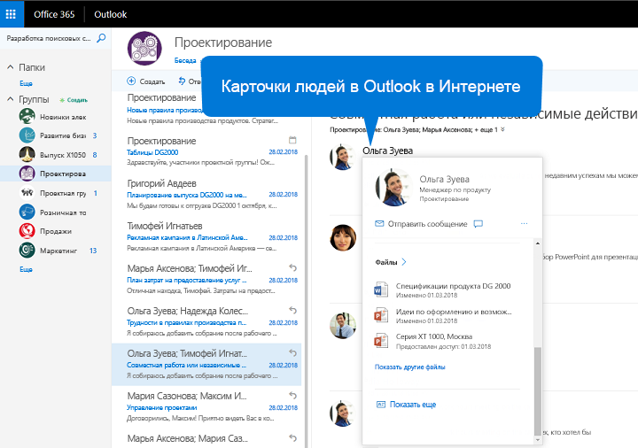

# <a name="overview-of-social-intelligence-and-analytics-in-microsoft-graph"></a>Обзор социальной аналитики в Microsoft Graph

Сотни миллионов пользователей облачных служб Microsoft 365 составляют часть ядра Microsoft Graph. Службы Microsoft Graph управляют данными пользователей, защищают их и при наличии необходимых разрешений предоставляют к ним доступ, чтобы стимулировать работу и креатив в компаниях. Среди всех данных пользователя, доступных в Microsoft Graph, особый интерес представляют данные о его социальных взаимодействиях. Их анализ дает возможность получить ответы на следующие вопросы:

- "К кому должен обращаться пользователь для получения информации по этой теме?"
- "Какие документы ему интереснее всего?"

Вы можете использовать API людей и API аналитики в Microsoft Graph для создания более удобных приложений с доступом к важным для пользователя людям и документам.

API людей возвращает людей, упорядоченных по релевантности для пользователя на основе его контактов, информации о нем из социальных сетей, каталога организации и недавнего общения по электронной почте и в Skype. Это особенно полезно в сценариях выбора людей.

API аналитики использует расширенную аналитику и машинное обучение для предоставления наиболее релевантных файлов, необходимых пользователю в течение рабочего дня. API обеспечивает работу привычных функций Office 365, в том числе Office Delve, начальной страницы SharePoint, представления Discover в OneDrive для бизнеса и Outlook в Интернете.


## <a name="why-integrate-with-people-data"></a>Преимущества интеграции с данными о людях

API людей возвращает данные одной сущности, [person](/graph/api/resources/person?view=graph-rest-1.0), которые включают типичные данные о физическом лице в современном деловом мире. Что делает данные **person** особенно полезными? Их _релевантность_ для пользователя Microsoft Graph. Релевантность указывается в баллах для каждого человека, которые рассчитываются на основе шаблонов общения и взаимодействия пользователя, а также его деловых связей. Данные о _релевантности_ применяются в основном тремя способами.

### <a name="browse-people-by-relevance"></a>Просмотр людей по релевантности

При наличии соответствующих [разрешений](people-example.md#authorization) вы можете просматривать людей, связанных с вошедшим пользователем или другими пользователями из его организации. Вы получаете коллекцию объектов **person**, упорядоченных по релевантности. Вы можете дополнительно [настроить](people-example.md#browse-people) коллекцию возвращаемых объектов **person**, указав параметры запроса `top`, `skip`, `orderby`, `select` и `filter`.

### <a name="fuzzy-searches-based-on-people-criteria"></a>Нестрогий поиск на основе критериев людей

API людей позволяет искать людей, релевантных для вошедшего пользователя, если приложение получило разрешения от такого пользователя. (Узнайте больше о [разрешениях для пользователей](permissions-reference.md#people-permissions).)

Нестрогий поиск возвращает результаты на основе точных совпадений, а также выводов о целях поиска. В приведенном ниже примере возвращаются объекты **person**, релевантные для вошедшего пользователя. Имя _или адрес электронной почты_ такого пользователя содержит слово, начинающееся с буквы "j".

<!-- { "blockType": "ignored" } -->
```http
GET /me/people/?$search=j
```

### <a name="fuzzy-searches-based-on-topic-criteria"></a>Нестрогий поиск на основе критериев темы

API людей также позволяет искать людей, релевантных для вошедшего пользователя, которые при общении с ним выразили интерес к определенным "темам". Темы — это просто слова, которые пользователи чаще всего использовали в своих сообщениях. Майкрософт извлекает и индексирует эти слова без учета контекста, чтобы искать по неточному соответствию было проще.

Следующий пример иллюстрирует выводы о цели поиска по теме "жук" (англ. "beetle"):

<!-- { "blockType": "ignored" } -->
```http
GET /me/people/?$search="topic:beetle" 
```

Нестрогий поиск по индексу данных темы возвращает экземпляры, означающие насекомое, знаменитый автомобиль "Фольксваген Жук", группу Beatles и другие определения.


## <a name="why-integrate-with-document-based-insights-preview"></a>Преимущества интеграции аналитики на основе документов (предварительная версия)

### <a name="use-intelligence-to-improve-collaboration"></a>Используйте аналитику для улучшения совместной работы

Во время повседневной деятельности пользователи часто работают с огромными объемами информации, хранящейся во многих документах, и взаимодействуют с другими пользователями различными способами. Важно, чтобы они всегда могли найти нужную информацию в нужный момент.

Используйте API аналитики, который включает API [популярных](/graph/api/resources/insights-trending?view=graph-rest-beta), [общих](/graph/api/resources/insights-shared?view=graph-rest-beta) и [использованных](/graph/api/resources/insights-used?view=graph-rest-beta) файлов, чтобы показывать файлы Office 365 на основе текущего контекста и потребностей пользователей, повышая их продуктивность и улучшая совместную работу в организации.

Результаты API аналитики легко отобразить в приложении. Каждый результат поступает вместе с набором общих свойств визуализации, например URL-адресом изображения или текстом для предварительного просмотра.

### <a name="make-relevant-content-visible"></a>Сделайте релевантное содержимое видимым

В Office 365 Delve использует аналитические сведения _trending_, чтобы пользователям было проще находить документы, интересующие их в данный момент. См. рисунок 1.

Вы можете использовать сущность [trending](/graph/api/resources/insights-trending?view=graph-rest-beta) в API аналитики программным способом, чтобы обеспечить аналогичное взаимодействие с пользователями приложения. Используйте сущность **trending**, чтобы подключаться к популярным документам, важным для пользователя. API [перечисления популярных документов](/graph/api/insights-list-trending?view=graph-rest-beta) возвращает отсортированные по релевантности файлы, хранящиеся на сайтах групп в OneDrive или SharePoint. Первыми идут наиболее важные. 

**Рисунок 1. Delve в Office 365 возвращает популярные документы**


### <a name="allow-users-to-collaborate-and-get-back-to-work"></a>Разрешите пользователям работать с коллегами и возвращаться к работе

Новые карточки людей Office 365 подключаются к аналитическим сведениям _used_ и _shared_ для установления связей между людьми и единицами знания. На карточке человека отображаются релевантные для него документы. Карточки людей отображаются во всех программах набора, например в Outlook в Интернете. См. рисунок 2.

API аналитики предоставляет аналогичную функциональность с сущностями [used](/graph/api/resources/insights-used?view=graph-rest-beta) и [shared](/graph/api/resources/insights-shared?view=graph-rest-beta). Они возвращают объекты, которые пользователь недавно просматривал или применял в работе или которыми с ним недавно поделились коллеги в Office 365.

**Рисунок 2. Outlook в Интернете отображает карточку пользователя**



## <a name="api-reference"></a>Справочные материалы по API
Ищете справочные материалы по API для этих служб?

- [API людей в Microsoft Graph версии 1.0](/graph/api/resources/social-overview?view=graph-rest-1.0)
- [API социальной аналитики в бета-версии Microsoft Graph](/graph/api/resources/social-overview?view=graph-rest-beta)

## <a name="next-steps"></a>Дальнейшие действия

* Опробуйте API людей и аналитики с собственными файлами в [песочнице Graph](https://developer.microsoft.com/graph/graph-explorer). Выполните вход и выберите **Показать другие примеры** в столбце слева. Включите в меню параметры **Люди** и **Аналитика (бета-версия)**.
* Узнайте больше об [API людей](people-example.md) и сущности [person](/graph/api/resources/person?view=graph-rest-1.0).
* Перед использованием API аналитики ознакомьтесь с разделом [Использование API аналитики](/graph/api/resources/insights?view=graph-rest-beta).
