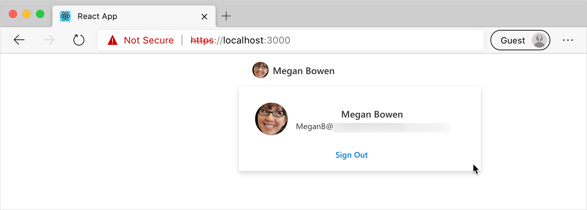
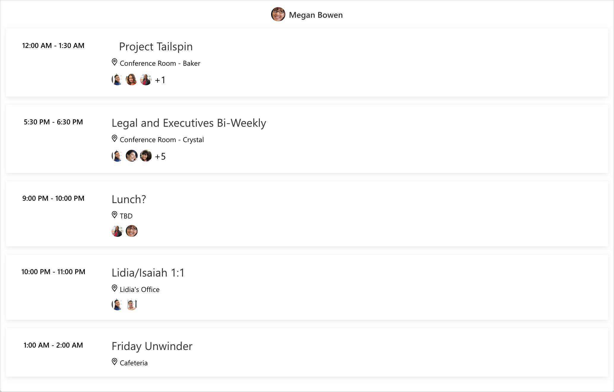

# <a name="use-the-microsoft-graph-toolkit-with-react"></a>Использование набора средств Microsoft Graph с откликом

Набор инструментов Microsoft Graph — это набор веб-компонентов, упрощающих подключение к Microsoft Graph и позволяющий сосредоточиться на вашем приложении. Набор средств Microsoft Graph доступен в качестве универсального набора веб-компонентов, распространяемых через пакет **@microsoft/МГТ** NPM.

Если вы создаете приложения с помощью реагирующих, вы можете использовать пакет **@microsoft/МГТ-РЕАКТ** , который упаковывает веб-компоненты набора средств Microsoft Graph в компоненты "реагирующий" и упрощает передачу сложных данных.

В этой статье описывается пошаговый процесс использования набора средств Microsoft Graph для создания приложения с откликом и его подключения к Microsoft 365. После выполнения этих действий у вас будет приложение с откликом, в котором показаны запланированные встречи пользователя, выполнившего вход в Microsoft 365.

## <a name="prerequisites"></a>Необходимые компоненты

Для выполнения действий, описанных в этой статье, вам потребуется среда разработки Microsoft 365 и несколько средств. Подробнее: [Начало работы](./overview.md).

## <a name="create-a-react-app"></a>Создание реагирующих приложений

Создайте новое приложение для реагирования, выполнив следующую команду. При этом будет создано новое Реагируее приложение с использованием TypeScript, которое поможет вам написать более надежный код и избежать ошибок времени выполнения.

```cmd
npx create-react-app my-m365-app --template typescript
```

Измените рабочий каталог на вновь созданное приложение.

```cmd
cd my-m365-app
```

Затем установите пакет управления " **центр** управления NPM", который содержит компоненты, реагирующие на набор инструментов Microsoft Graph.

```cmd
npm i @microsoft/mgt-react
```

Подтвердите, что вы можете запустить приложение.

```cmd
HTTPS=true npm start
```

> [!IMPORTANT]
> Чтобы приложение могло пройти проверку подлинности в Microsoft 365, его необходимо запускать на HTTPS. Для локального тестирования с помощью сценариев реагирования можно настроить локальный веб-сервер для работы с протоколом HTTPS, задав `HTTPS` для переменной среды значение `true` . Это можно сделать каждый раз, добавив перед `npm start` командой `HTTPS=true` (работает только в bash) или задав глобальную переменную среды на компьютере.

Вы должны иметь возможность открыть приложение в браузере с помощью `https://localhost:3000` .

[!INCLUDE [AAD with implicit flow app registration](../includes/aad-app-registration-spa.md)]

## <a name="connect-react-app-to-microsoft-365"></a>Подключение приложения, реагирующий на реагирование, в Microsoft 365

Теперь, когда вы зарегистрировали свое приложение с помощью Azure Active Directory (Azure AD), вы можете подключить приложение, реагируя к Microsoft 365. Для начала разрешите пользователям входить в приложение с помощью учетной записи Майкрософт.

### <a name="copy-the-azure-ad-application-registration-id"></a>Копирование идентификатора регистрации приложения Azure AD

1. На портале Azure перейдите к регистрационному приложению.
1. Убедитесь, что вы используете страницу **Обзор** .
1. В разделе **Essentials (основные** сведения) скопируйте значение свойства **ID Application (Client)** .

### <a name="configure-the-microsoft-graph-toolkit-authentication-provider"></a>Настройка поставщика проверки подлинности набора средств Microsoft Graph

Затем настройте поставщика проверки подлинности, который должен использовать набор средств Microsoft Graph. В этом случае вы будете использовать MSAL, который является хорошим значением по умолчанию для создания автономных приложений. Если вы используете любую из точек расширения Microsoft 365, таких как teams или SharePoint, вы будете использовать [других поставщиков](../providers.md).

1. В редакторе кода откройте **src/индекс.** файл и в список импортов добавьте:

    ```tsx
    import { MsalProvider, Providers } from '@microsoft/mgt';
    ```

1. После последнего `import` оператора инициализируйте набор инструментов Microsoft Graph с помощью поставщика MSAL.

    ```tsx
    Providers.globalProvider = new MsalProvider({
      clientId: 'REPLACE_WITH_CLIENTID'
    });
    ```

    Замените значение `clientId` Свойства на значение, `Application (client) ID` скопированное ранее на портале Azure.

В результате этих изменений файл **src/index. Целевой** файл будет выглядеть так, как показано ниже.

  ```tsx
  import { MsalProvider, Providers } from '@microsoft/mgt';
  import React from 'react';
  import ReactDOM from 'react-dom';
  import App from './App';
  import './index.css';
  import * as serviceWorker from './serviceWorker';
  
  Providers.globalProvider = new MsalProvider({
    clientId: 'REPLACE_WITH_CLIENTID'
  });
  
  ReactDOM.render(
    <React.StrictMode>
      <App />
    </React.StrictMode>,
    document.getElementById('root')
  );
  
  // If you want your app to work offline and load faster, you can change
  // unregister() to register() below. Note this comes with some pitfalls.
  // Learn more about service workers: https://bit.ly/CRA-PWA
  serviceWorker.unregister();
  ```

### <a name="add-the-sign-in-button"></a>Добавление кнопки входа

Добавьте для **входа** компонент "реакция на Office Graph Toolkit", в котором будет отображаться кнопка **входа** пользователи могут использовать для входа в приложение с помощью своей учетной записи Майкрософт.

1. В редакторе кода откройте файл **src/App. Целевой** файл и добавьте в список импортируемых компонентов:

    ```tsx
    import { Login } from '@microsoft/mgt-react';
    ```

1. В `App` функции замените содержимое `return` предложения основной структурой, включая компонент входа Microsoft Graph Toolkit:

    ```tsx
    <div className="App">
      <header>
        <Login />
      </header>
    </div>
    ```

В результате этих изменений файл **src/App. Целевой** файл будет выглядеть так, как показано ниже.
```tsx
import { MsalProvider, Providers } from '@microsoft/mgt';
import { Login } from '@microsoft/mgt-react';
import React from 'react';
import './App.css';

function App() {
  Providers.globalProvider = new MsalProvider({
    clientId: 'REPLACE_WITH_CLIENTID'
  });

  return (
    <div className="App">
      <header>
        <Login />
      </header>
    </div>
  );
}

export default App;
```

### <a name="test-signing-in-to-your-application"></a>Проверка входа в приложение

Теперь вы можете войти в приложение с помощью учетной записи Майкрософт.

1. Вернитесь в браузер, где запущено работающее приложение. Теперь должна появиться кнопка **войти** .
1. При нажатии кнопки **входа** вам будет предложено войти с помощью учетной записи Майкрософт (вы можете использовать ту же учетную запись, что и у вас есть доступ к порталу Azure).
1. Так как вы впервые используете это приложение Azure AD, вам необходимо согласиться с его использованием в вашей организации.
1. После входа вы будете перенаправлены в приложение, используемое для реагирования. Обратите внимание, что кнопка **входа** изменилась, отображая имя пользователя, на  .

## <a name="load-data-from-microsoft-365"></a>Загрузка данных из Microsoft 365

Набор средств Microsoft Graph не только упрощает проверку подлинности в Microsoft 365, но и загрузку данных. В этом примере показано, как Показать календарь пользователя, выполнившего вход.

### <a name="specify-permissions-needed-for-your-application"></a>Указание разрешений, необходимых для приложения

Перед загрузкой данных из Microsoft 365 необходимо указать список областей разрешений, которые должно быть назначено вашему приложению для доступа к данным пользователя. Эти области различаются в зависимости от типа информации, которую вы хотите показать. В этом случае необходим доступ к календарю пользователей, а также к основному доступу к сведениям о пользователях, которые также отображаются в календаре. Вы можете найти области, необходимые для каждого API, в [документации по API Microsoft Graph](/graph/api/overview?toc=.%2Fref%2Ftoc.json&view=graph-rest-1.0).

1. В редакторе кода откройте файл **src/index. Целевой** файл и обновите код инициализации поставщика.

    ```tsx
    Providers.globalProvider = new MsalProvider({
      clientId: 'd7cb93c9-9097-4e38-8f06-7c0088ac3318',
      scopes: ['calendars.read', 'user.read', 'openid', 'profile', 'people.read', 'user.readbasic.all']
    });
    ```

### <a name="show-users-data-after-signing-in"></a>Отображение данных пользователя после входа

Затем Расширьте приложение, чтобы отобразить данные из календаря пользователя. Доступ к этим сведениям можно получить только после того, как пользователь выполнил вход. Для этого необходимо отслеживать состояние входа пользователя и отображать данные календаря после того, как пользователь войдет с помощью учетной записи Майкрософт.

#### <a name="track-users-sign-in-state"></a>Отслеживание состояния входа пользователя

Чтобы отслеживать состояние входа пользователя в приложение, вы будете использовать отклики и обработчики `useState` `useEffect` в сочетании с обработчиками событий поставщика.

1. В редакторе кода откройте файл **src/App. Целевой** файл и расширьте существующий оператор реагируя `import` .

    ```tsx
    import React, { useState, useEffect } from 'react';
    ```

1. Импортируйте `Provider` `ProviderState` типы и типы из набора инструментов Microsoft Graph, добавив их в "Импорт".

    ```tsx
    import { Providers, ProviderState } from '@microsoft/mgt';
    ```

1. Добавьте пользовательскую функцию с именем `useIsSignedIn` , позволяющую отслеживать состояние входа пользователя в приложении.

    ```tsx
    function useIsSignedIn(): [boolean] {
      const [isSignedIn, setIsSignedIn] = useState(false);
    
      useEffect(() => {
        const updateState = () => {
          const provider = Providers.globalProvider;
          setIsSignedIn(provider && provider.state === ProviderState.SignedIn);
        };
    
        Providers.onProviderUpdated(updateState);
        updateState();
    
        return () => {
          Providers.removeProviderUpdatedListener(updateState);
        }
      }, []);
    
      return [isSignedIn];
    }
    ```

Эта функция выполняет две задачи. Во-первых, с помощью `useState` обработчика реагирующих включается состояние отслеживания в компоненте. При изменении состояния реагирует на то, что компонент будет повторно визуализирован. Во-вторых, с помощью `useEffect` обработчика реагирования он расширяет жизненный цикл компонента, отслеживая изменения в поставщике набора средств Microsoft Graph и обновляя компонент при необходимости.

#### <a name="load-users-calendar-if-user-is-signed-in"></a>Загружать календарь пользователя, если пользователь вошел в систему

Теперь, когда вы отслеживаете состояние входа пользователя в приложении, вы можете отобразить свой календарь после того, как они вошли в систему.

1. В редакторе кода откройте файл **src/App. Целевой** файл, а затем в функции **app** добавьте:

    ```tsx
    const [isSignedIn] = useIsSignedIn();
    ```

    Этот параметр определяет логическую `isSignedIn` константу, которую можно использовать для определения того, вошел ли пользователь в систему в данный момент.

1. Расширьте содержимое `return` предложения с дополнительным `div` компонентом и компонентом повестки набора средств Microsoft Graph.

    ```tsx
    <div>
      {isSignedIn &&
        <Agenda />}
    </div>
    ```

В результате этих изменений файл **src/App. Целевой** должен выглядеть следующим образом:

```tsx
import { Providers, ProviderState } from '@microsoft/mgt';
import { Agenda, Login } from '@microsoft/mgt-react';
import React, { useState, useEffect } from 'react';
import './App.css';

function useIsSignedIn(): [boolean] {
  const [isSignedIn, setIsSignedIn] = useState(false);

  useEffect(() => {
    const updateState = () => {
      const provider = Providers.globalProvider;
      setIsSignedIn(provider && provider.state === ProviderState.SignedIn);
    };

    Providers.onProviderUpdated(updateState);
    updateState();

    return () => {
      Providers.removeProviderUpdatedListener(updateState);
    }
  }, []);

  return [isSignedIn];
}

function App() {
  const [isSignedIn] = useIsSignedIn();

  return (
    <div className="App">
      <header>
        <Login />
      </header>
      <div>
        {isSignedIn &&
          <Agenda />}
      </div>
    </div>
  );
}

export default App;
```

### <a name="test-showing-users-calendar-after-they-signed-in"></a>Тестирование отображения календаря пользователя после входа

После выполнения этих изменений после входа в приложение с помощью учетной записи Майкрософт вы должны увидеть свой календарь.

1. Чтобы просмотреть изменения, закройте браузер и откройте его еще раз и перейдите по адресу `https://localhost:3000` . Это делается потому, что вы изменили значение `scopes` свойства, которое влияет на маркер доступа, который вы запрашиваете из Azure AD.
1. Нажмите кнопку **входа** и войдите с помощью своей учетной записи Майкрософт. Обратите внимание на добавления в список разрешений, запрашиваемых в запросе согласия. Это связано с тем, что в свойстве включены дополнительные разрешения `scope` .
1. После того как вы отправили использование приложения, вам будут видны сведения о текущем пользователе и их календаре.



## <a name="next-steps"></a>Дальнейшие действия

- Узнайте [, что находится в наборе средств Microsoft Graph](../overview.md).
- Опробуйте компоненты в [интерактивная среда](https://mgt.dev).
- Задайте вопрос о [переполнении стека](https://aka.ms/mgt-question).
- Сообщать об ошибках или оставлять запрос на функцию в [GitHub](https://aka.ms/mgt).
